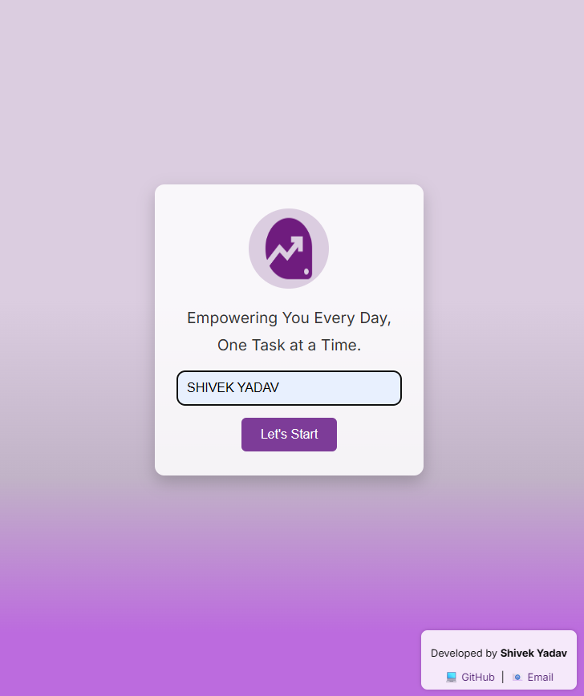

<!-- Profile Views -->
<p align="right">
  
</p>

<!-- Header GIF -->
<p align="center">
  
</p>

<h1 align="center">🧠✨ Advance To-Do App ✨🧠</h1>

<!-- Typing effect -->
<p align="center">
  
</p>

<!-- Project Preview -->
<p align="center">
<p align="center">  </p>
  
</p>

<p align="center">  </p>
<p align="center">
  
</p><p align="center">  </p>
<p align="center">
  
</p>
<p align="center">  </p>

---

## 📁 Folder Structure<br>
Advance-to-do/<br>
├── index.html # Welcome page (name input)<br>
├── taskmanager.html # Main task manager UI<br>
├── style.css # Shared styles with dark mode and layout<br>
├── script.js # Landing page JS for username and redirect<br>
├── taskmanager.js # Main logic: CRUD + theme + particles<br>
└── particles.min.js # Animation library<br>


---

## 🧠 Tech Stack

<p align="center">
  
</p>

---

## 🚀 Getting Started

1. **Clone the repo**
   ```bash
   git clone https://github.com/shivek78/Adavnce-to-do.git```

2. Enter project folder

```bash
cd Adavnce-to-do
```
3. Run the app<br>
Open index.html in any browser
<br>
---
<h1>📬 Contact Me<h1>


<p align="center"> <a href="mailto:shivekyadav0786@gmail.com"></a> <a href="https://linkedin.com/in/shivek-yadav"></a> <a href="https://github.com/shivek78"></a>


<p align="center">  </p>
<p align="center">  </p>

<p align="center">  </p>
